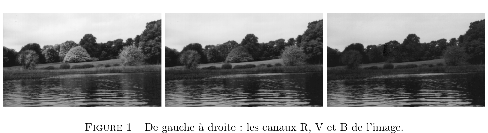
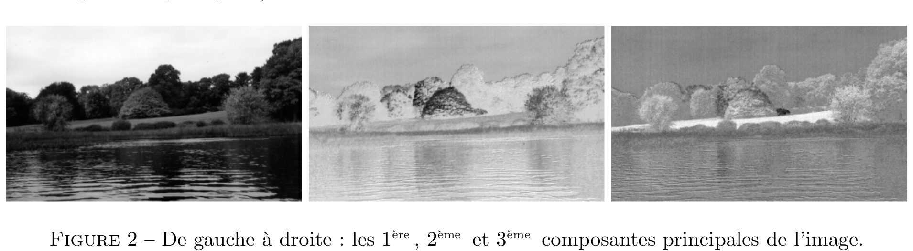
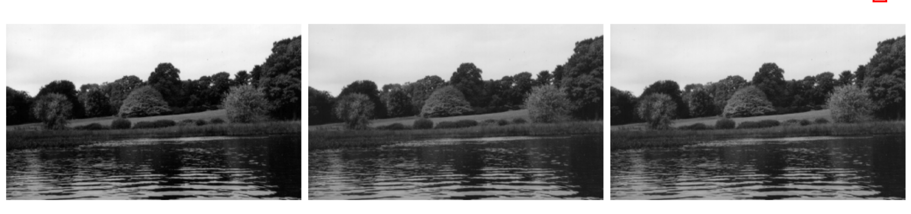

# Espaces de représentation des couleurs

## Exercice 1 - Corrélations et contrastes des canaux RVB

Le script *exercice_1.jl*  lit  l'image *autumn.tif* codée en RVB (Rouge, Vert, Bleu) et la stocke dans une matrice tridimensionnelle I de taille *hauteur* ``\times`` *largeur* ``\times 3 .`` On peut séparer cette matrice en trois sousmatrices bidimensionnelles appelées canaux : ``\mathrm{R}=\mathrm{I}(\mathrm{i}, \mathrm{j}, 1)`` pour le canal rouge, ``\mathrm{V}=\mathrm{I}(\mathrm{i}, \mathrm{j}, 2)`` pour le canal vert, et 
``\mathrm{B}=\mathrm{I}(\mathrm{i}, \mathrm{j}, 3)`` pour le canal bleu. Chacun d'entre eux est composé d'entiers compris entre 0 et 255, qui représentent l'intensité lumineuse du pixel situé sur la ligne ``\mathrm{i}`` et la colonne ``\mathrm{j}``.De part leur dénomination, chaque canal apporte donc une part de couleur à l'image, que ce soit du rouge, du vert ou du bleu.

En affichant les matrices ``\mathrm{I},\mathrm{R}, \mathrm{V}`` et ``\mathrm{B}`` sous forme d'images, on peut observer une forte corrélation entre les trois canaux, à part pour les régions très colorées (comme pour l'arbre situé au centre de l'image que l'on ne distingue plus dans le canal bleu par exemple). Dans une seconde fenêtre, les pixels sont considérés comme des points de ``\mathbb{R}^{3}`` que l'on affiche dans un repère dont les axes correspondent aux trois niveaux de couleur. Ils forment un nuage de forme très allongée suivant plusieurs axes simultanément, ce qui confirme l'observation précédente, à savoir que les trois canaux sont fortement corrélés.

Complétez ce script de manière à calculer la matrice ``\Sigma``, notée par la suite Sigma, de variance/covariance des variables aléatoires correspondant aux trois canaux ``\mathrm{R}, \mathrm{V}`` et ``\mathrm{B}(\text { matrice de taille } 3 \times 3)`` 
**[Attention]** ``\Rightarrow`` N'oubliez pas de **centrer** la matrice ``X`` des données et **sans utiliser** les fonctions *var* et *cov* de Julia qui appliquent des prétraitements aux données.

Le **coefficient de corrélation linéaire** ``r_{Y Z} \in[-1,1]`` entre deux canaux ``Y`` et ``Z`` s'écrit sous la forme ``r_{Y Z}=\sigma_{Y Z} /\left(\sigma_{Y} * \sigma_{Z}\right),`` où ``\sigma_{Y}`` et ``\sigma_{Z}`` désignent respectivement l'écart-type de ``Y`` et de ``Z,`` et ``\sigma_{Y Z}`` la covariance entre ``Y`` et ``Z``. D'autre part, la **proportion de contraste** dans le canal ``Y`` s'écrit sous la forme ``c_{Y}=\sigma_{Y}^{2} /\left(\sigma_{R}^{2}+\sigma_{V}^{2}+\sigma_{B}^{2}\right),`` où ``\sigma_{Y}^{2}`` désigne la variance de ``Y .`` Terminez l'écriture du script exercice_1.jl en calculant les coefficients de corrélation linéaire et les proportions de contraste de cette image (optionnel : utilisez la fonction *@printf* pour l'affichage).
 **[Attention]** ``\Rightarrow`` Ne confondez pas écart-type et variance.

 ### Transmission d’une image couleur par un seul canal

Le choix d’un espace de représentation des couleurs s’est posé lorsque les chaı̂nes de télévision sont passées à la couleur, dans les années 1960. En effet, il était inutile de transmettre trois canaux R, V et B aux utilisateurs (encore nombreux) possédant des téléviseurs “noir et blanc” ne pouvant afficher qu’un seul canal. Le principal critère étant de maximiser la proportion de contraste de ce canal unique, suffisait-il de transmettre un des trois canaux R, V ou B choisi arbitrairement ? Utilisez maintenant l’image *gantrycrane.png*, qui est une image à dominante bleue, dans le script *exercice_1.jl* et déduisez-en pourquoi cette idée n’aurait pas été acceptable. La conversion d’une image couleur en une image en niveaux de gris consiste en une réduction de dimension et on cherche donc effectuer une Analyse en Composantes Principales (ACP) sur l’image afin de récupérer un maximum d’information sur la première composante principale qui sera la nouvelle image en niveaux de gris

 ## Exercice 2 - Analyse en Composantes Principales

Effectuez une copie du script exercice_1.jl, de nom exercice_2.jl, que vous modifierez de manière à effectuer l’ACP des données contenues dans la matrice X.

La matrice Sigma de variance/covariance est symétrique et réelle. Elle admet donc une base orthonormée de vecteurs propres. Calculez ses valeurs propres et vecteurs propres à l’aide de l’appel à la fonction :\[W,D\] = eigen(Sigma). Les valeurs propres de Sigma sont stockées sur la diagonale de la matrice D. Triez 
ces valeurs par ordre décroissant, à l’aide la fonction sortperm de Julia (avec l’option *rev=true* pour un tri décroissant). Les vecteurs propres de Sigma, appelés aussi vecteurs principaux dans le cas de l’ACP, sont stockés sur les trois colonnes de la matrice W. La matrice W est donc orthogonale
(son inverse est égale à sa transposée) et constitue la matrice de passage entre le repère RVB et celui des composantes principales. Calculez la matrice C des composantes principales des pixels comme la projection de l’image de départ I par la matrice de passage W. ``\\``
**[Attention]** ``\Rightarrow`` N’oubliez pas de trier les colonnes de W pour qu’elles coı̈ncident à nouveau avec leurs valeurs propres de Sigma triées précédemment. ``\\``
``\\``Affichez les trois colonnes de la matrice C sous forme d’images avec les fonctions reshape et size de Julia. Calculez les coefficients de corrélation linéaire et les proportions de contraste dans le nouveau repère ainsi que la proportion de contraste obtenue par projection sur la première composante principale. Commentez (on pourra également tenter d’analyser le nouveau nuage de points dans l’espace des trois composantes principales).

 ## Exercice 3 - Combinaisons linéaires des trois canaux RVB

 Si le critère retenu est celui du contraste, l'ACP est le meilleur moyen pour convertir une image couleur en une image en niveaux de gris. Cependant, la matrice de passage dépend complètement de l'image considérée. Cependant, il n'était pas envisageable, dans les années 1960, d'effectuer une ACP pour chaque image d'une séquence télédiffusée. C'est pourquoi une matrice de passage commune à toutes les images couleur a été choisie.

En utilisant les deux images *autumn.tiff* et *pears.png* dans le script *exercice_2.jl*, vérifiez que les coordonnées du vecteur propre de Sigma correspondant à sa plus grande valeur propre sont toutes trois très proches de ``1 / \sqrt{3} \approx 0,5774``. Cela voudrait dire que la maximisation de la proportion de contraste, c'est-à-dire de la variance, qui caractérise la première composante principale, s'obtient en donnant le même poids aux trois canaux. Bien que cette affirmation soit erronée lorsque la proportion de contraste differe beaucoup d'un canal à l'autre (faites le test sur l'image *gantrycrane.png*), elle est vraie en moyenne. Donner le même poids aux trois canaux revient à transformer une image couleur en une image en niveaux de gris de la manière la plus intuitive qui soit, à savoir :

``\hspace*{2.5cm}`` ``I_{nvg}=\frac{1}{3}(R+V+B)``

Pourtant, si l'on regarde en détail la fonction *rgb2gray* de Matlab, qui est spécifiquement conçue pour transformer une image ``\mathrm{RVB}`` en une image en niveaux de gris, on remarquera qu'elle effectue une autre combinaison linéaire que la simple moyenne des trois canaux (cf. help rgb2gray):

``\hspace*{2.5cm}`` ``Y=0,2989 R + 0,5870 V + 0,1140 B``

qui disymétrise les canaux ``\mathrm{R}, \mathrm{V}`` et ``\mathrm{B}``, contrairement à (1) . Cela vient du fait que le système visuel humain n'est pas également sensible aux différentes fréquences lumineuses. En particulier, comme sa courbe de sensibilité est maximale dans le vert, le poids du canal V dans (2) est supérieur aux poids des deux autres canaux.

Effectuez une copie du script *exercice_2.jl*, de nom *exercice_3.jl*, que vous modifierez de manière à afficher sur une même figure les quatre images suivantes : l'image couleur d'origine, sa première composante principale, et les deux images correspondant aux combinaisons linéaires (1) et (2). Parmi les trois images en niveaux de gris, laquelle vous semble-t-elle présenter le meilleur contraste? Testez différentes images internes de Matlab: autumn.tif, gantrycrane.png, pears.png, coloredChips.png, etc

Figure 3 – De gauche à droite : la 1 ère composante principale de l’image, la moyenne des 3 canaux, la combinaison linéaire proposée par Matlab.