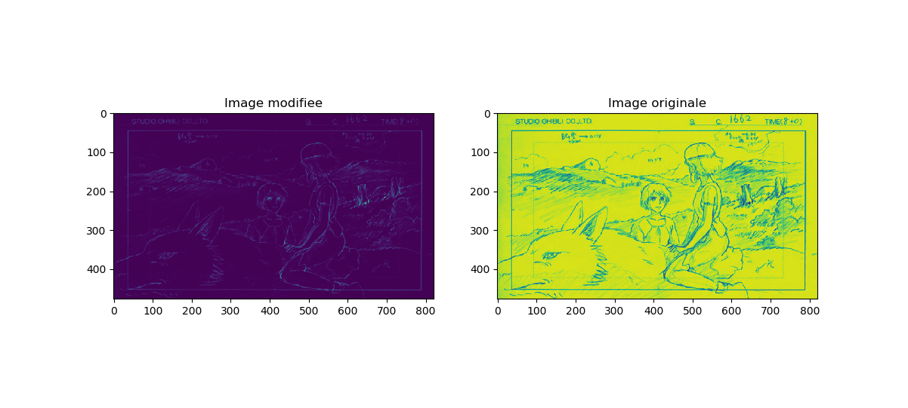

# Modélisation paramétrique

## Exercice 1: estimation par les moindres carrés ordinaires

À partir d’un ensemble de points dont la forme rappelle celle d’une ellipse, est-il possible de trouver l’ellipse qui passe << au plus près >> de ces points ?

Ce genre de question se pose très souvent en analyse d’images. Il s’agit d’un problème d’estimation.
Dans ce TP, vous allez tester plusieurs méthodes d’estimation des paramètres d’une ellipse.

Commencez par lancer le script **Donnees.jl**, qui affiche une ellipse tirée aléatoirement, ainsi que n points placés aléatoirement sur cette ellipse, dont chaque coordonnée est bruitée par un bruit additif gaussien.

L’équation cartésienne d’une conique (ellipse, parabole, hyperbole) est une équation polynomiale de degré 2 :

``\hspace*{2.5cm}``  ``\alpha x^{2}+\beta x y+\gamma y^{2}+\delta x+\epsilon y+\phi=0``   ``\hspace*{1.5cm}`` (1)

Les six paramètres ``(\alpha, \beta, \gamma, \delta, \epsilon, \phi)`` ne sont pas indépendants, puisque la conique ne change pas si ces six paramètres sont multipliés par un même facteur. Cela signifie qu’une conique possède cinq << degrés
de liberté >>.

Les équations (1) forment un système linéaire homogène ``AB = 0``, où ``B=[\alpha, \beta, \gamma, \delta, \epsilon, \phi]^{\top}`` et ``A`` est une matrice de taile ``n \times 6``. Pour éviter la solution << triviale >> ``\widehat{B}=0``, on peut imposer une contrainte linéaire sur les paramètre, par exemple `` \alpha + \gamma = 1`` (comme une ellipse vérifie ``\beta^{2} - 4\alpha \gamma < 0``, il est impossible que ``\alpha + \beta = 0``). Cette contrainte ajoute une équation linéaire *non homogène* au système des équation (1), qui n'admet donc plus la solution triviale ``\widehat{B}=0``.

Complétez le script **exercice_1.jl** par l’écriture de la fonction **MCO**, qui estime X par résolution approchée du nouveau système, au sens des moindres carrés ordinaires.

**Remarque** : on utilisera la fonction **pinv** pour la pseudo-inverse.

Nous vous fournissons le script **maximum_vraisemblance.jl** correspondant à l’estimation des paramètres de l’ellipse par le maximum de vraisemblance (cf TP1 de Statistiques du premier semestre). Vous constatez que l’estimation est bien plus fiable par les moindres carrés ordinaires que par le maximum de vraisemblance.

Vous pouvez reformuler le problème en ne considérant que cinq paramètres en éliminant, soit le ``\alpha``, soit le ``\gamma`` et vérifier que la solution est la même à un facteur multiplicatif près.

## Exercice 2: estimation d'une transformation sur des images

L’objectif est de reconstruire des images préalablement modifiées par une transformation non linéaire bruitée.

``\hspace*{1.5cm}`` 

Soit I une image de taille ``n \times m``. Une transformation non linéaire notée ``T`` est réalisée sur chaque niveau de gris ``I_{ij}`` du pixel ``(i, j)`` de l’image ``I``. L’image modifiée après transformation est notée ``J``, dont les éléments sont définis par :

``\hspace*{2cm}``  ``\forall i \in\{1, \ldots, n\}, \forall j \in\{1, \ldots, m\}, \quad J_{i j}=T\left(\alpha, \beta, I_{i j}\right)=e^{-\alpha t_{i j}+\beta}``  ``\hspace*{1.5cm}`` (2)

où ``(\alpha, \beta)`` sont des paramètres réels.

#### Problème aux moindres carrés ordinaires

On dispose d’une partie de l’image modifiée par la transformation ``T`` avec un bruit additif aléatoire et de la partie de l’image originale correspondante.

``\hspace*{1.5cm}`` 1. Écrivez la formulation matricielle du problème aux moindres carrés ordinaires (MCO) permettant d’estimer les paramètres ``(\alpha, \beta)`` de la fonction ``T`` définie par l’équation (2).

``\hspace*{1.5cm}`` 2. Résolvez le problème aux moindres carrés ordinaires à partir des données **Data** et **DataMod** issus respectivement des images originales et modifiées (**vars1 = matread("SG1.mat")**).

``\hspace*{1.5cm}`` 3. À partir des paramètres estimés et de l’image entière modifiée **ImMod**, reconstruisez l’image originale (issue de **ImSG1.mat**).

``\hspace*{1.5cm}`` 4. Estimez l’erreur aux moindres carrés (RMSE) entre l’image reconstruite et l’image originale.

#### Problème aux moindres carrés totaux

On propose de résoudre ce même problème en utilisant les moindres carrés totaux et la décomposition en valeurs singulières (SVD).

``\hspace*{1.5cm}`` 1. écrivez le problème aux moindres carrés totaux.

``\hspace*{1.5cm}`` 2. Résolvez le problème et reconstruisez l’image originale.

**Remarque :** on utilisera la fonction **svd**.

``\hspace*{1.5cm}`` 3. Estimez l'erreur aux moindres carrés (RMSE) entre l’image reconstruite et l’image originale. Comparez vos résultats avec les MCO.

``\hspace*{1.5cm}`` 4. Imaginez des applications à ce bruitage d’images.

