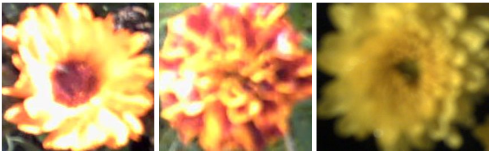

# Classification bayésienne

L’objectif est de réaliser un classifieur bayésien permettant de **classer** les images de trois espèces de
fleurs (ne recopiez pas les images, afin de préserver votre quota). Lancez le script *recup_donnees.jl*,
qui affiche des images de pensées, d’œillets et de chrysanthèmes. Vous constatez que ces images n’ont
pas toutes la même taille.

``\hspace*{3.5cm}`` FIGURE 1 - De gauche à droite : pensée, œillet, chrysanthème.

## Exercice 1 - Calcul de la couleur moyenne d’une image

Dans un premier temps, vous allez classer les images selon la couleur moyenne de chaque espèce de
fleurs.
Pour cela, les trois niveaux de couleur ``(R, V, B) \in [0, 255]^{3}`` , en chaque pixel de chaque image, sont
d’abord transformés en **niveaux de couleur normalisés** ``(r, v, b)``, qui sont définis de la manière
suivante :

``\hspace*{2.5cm}`` ``(r, v, b) = \frac{1}{max\{1,R+V+B\}}(R,V,B) \\``

Le principal intérêt des niveaux de couleur normalisés est que deux valeurs parmi ``(r, v, b)`` permettent de
déduire la troisième, puisque ``r+v+b = 1``, sauf dans le cas exceptionnel où ``(r, v, b) = (0, 0, 0)``. Une image
est donc caractérisée par les moyennes ``(\bar{r}, \bar{v}, \bar{b})``, ou plus simplement par ``(\bar{r},\bar{v})``, 
puisque ``\bar{r}+\bar{v}+\bar{b}=1``, c’est-à-dire par un vecteur ``x = (\bar{r},\bar{v}) \in \mathbb{R}^2`` que l’on 
appelle sa **couleur moyenne**. Compte tenu des différences de couleurs moyennes entre les trois espèces de fleurs, 
on postule que ce vecteur suffira à les distinguer.

!!! tip "Travail à effectuer"

    Écrivez la fonction *couleur\_moyenne*, qui calcule la couleur moyenne d’une image, c’est-à-dire ``x^{T} = (\bar{r},\bar{v})`` dans un vecteur ligne, 
    sans oublier de convertir les niveaux de couleur ``(R, V, B)`` auformat *float* (pour manipuler des réels) et de les normaliser.

Le script *exercice_1.jl* regroupe dans trois tableaux de données *X_pensees*, *X_oeillets* et *X_chrysanthemes* les valeurs moyennes calculées 
avec la fonction précédente pour chaque groupe d’images. Il affiche ensuite les couleurs moyennes de l’ensemble des images de fleurs sous la forme
de trois nuages de points de ``\mathbb{R}^2`` avec trois couleurs et symboles différents.

#### Question 
Au regard de cette figure, la couleur moyenne vous semble-t-elle une caractéristique suffisamment discriminante de ces trois espèces de fleurs ?

## Exercice 2 - Estimation de la vraisemblance de chaque espèce de fleurs

Les trois nuages de points précédents peuvent être modélisés par des lois normales bidimensionnelles.
Il est rappelé que la densité de probabilité d’une loi normale s’écrit, en dimension ``d`` :

``\hspace*{2.5cm}`` ``p(\mathbf{x})=\frac{1}{(2 \pi)^{d/2}(\operatorname{det} \Sigma)^{1/2}} \exp \left(-\frac{1}{2}(\mathbf{x}-\mu)^{\top} \Sigma^{-1}(\mathbf{x}-\mu)\right) \hspace*{2.0cm} (1) \\    \\``
où: ``\\``
``\hspace*{1.5cm}``  ``。\mu`` désigne l'espérance (la moyenne) des vecteurs ``\mathbf{x} \in \mathbb{R}^{d}: \mu=E[\mathbf{x}]=\frac{1}{n} \mathbf{x}^{\top} \mathbf{1}_{n} \\    \\``
``\hspace*{1.5cm}``  ``。\Sigma`` désigne la matrice de variance/covariance : ``\Sigma=E\left[(\mathbf{x}-\mu)(\mathbf{x}-\mu)^{\top}\right]=\frac{1}{n}\left(\mathbf{x}^{c}\right)^{\top} \mathbf{x}^{c} \\``

Dans le cadre bayésien, la vraisemblance de la classe ``\omega_{i}`` associée à chaque type de fleur, qui est caractérisée par la moyenne ``\mu_{i}`` et la matrice de variance/covariance ``\Sigma_{i},`` peut être modélisée par une loi normale analogue à (1): ``\\``
``\\ \hspace*{2.5cm}`` ``p\left(\mathbf{x}|\omega_{i}\right)=\frac{1}{(2 \pi)^{d / 2}\left(\operatorname{det} \Sigma_{i}\right)^{1 / 2}} \exp \left(-\frac{1}{2}\left(\mathbf{x}-\mu_{i}\right)^{\top} \Sigma_{i}^{-1}\left(\mathbf{x}-\mu_{i}\right)\right), \quad i \in[1,3] \\``

Il faut donc estimer les paramètres ``\mu_{i}`` et ``\Sigma_{i}`` des trois classes correspondant aux trois espèces de fleurs.``\\``

!!! tip "Travail à effectuer"

    Écrivez la fonction *estimation\_mu\_Sigma* permettant d’effectuer l’estimation empirique des paramètres d’une loi normale bidimensionnelle ``(d = 2)`` à partir d’une matrice de données ``X``.

Le script *exercice_2.jl* estime les paramètres ``\mu_i`` et ``\Sigma_i`` des trois classes ``\omega_i`` correspondant aux trois espèces de fleurs, à partir des tableaux de données *X_pensees*, *X_oeillets* et *X_chrysanthemes*, puis superpose la vraisemblance de chaque classe (en perspective 3D) au nuage de points à partir duquel elle a été estimée.

## Exercice 3 - Classification d’images de fleurs

Nous souhaitons maintenant prédire à quelle espèce de fleurs une image requête, ``\mathbf{x}``, doit être associée. Comme nous avons utilisé des données étiquetées (chacune des images étant associée à une espèce de fleurs), il s'agit de *classification supervisée*. Un premier type de classification consiste à affecter à ``\mathbf{x}`` la classe ``\omega_{i}`` qui maximise la vraisemblance ``p\left(\mathbf{x} | \omega_{i}\right) .`` Il s'agit alors d'un classifieur par *maximum de vraisemblance*.

!!! tip "Travail à effectuer"

    Modifiez le script *exercice_3.jl*, de manière à :
    1. partitionner le plan ``\mathbb{R}^2`` en trois parties correspondant aux trois classes de fleurs,
    2. les colorier en trois couleurs différentes associées à celles des nuages de points,
    3. afficher le pourcentage d’images bien classées sur l’ensemble des trois classes.

Par ailleurs, la règle de Bayes donne l'expression suivante de la probabilité ``a`` **posteriori** ``p\left(\omega_{i}|\mathbf{x}\right)`` c'est-à-dire de la probabilité pour que la classe ``\omega_{i}`` contienne ``\mathbf{x}`` : ``\\``
``\\ \hspace*{3.5cm}`` ``p\left(\omega_{i} | \mathbf{x}\right)=\frac{p\left(\mathbf{x}|\omega_{i}\right) p\left(\omega_{i}\right)}{p(\mathbf{x})} \hspace*{2.0cm} (2) \\``

Il semble naturel d'affecter à x la classe ``\omega_{i}`` qui maximise ``p(\omega_{i}|\mathbf{x}) .`` Une telle classification est dite par **maximum a posteriori** (MAP). Sachant que le dénominateur ``p(\mathbf{x})`` de (2) est indépendant de ``\omega_{i},`` il n'est pas nécessaire de le connaítre pour trouver le maximum des ``p(\omega_{i}|\mathbf{x})``. En revanche, il est nécessaire de connaítre la **probabilité a priori** ``p\left(\omega_{i}\right)`` de chaque classe ``\omega_{i},`` faute de quoi on fait généralement l'hypothèse que les classes sont équiprobables (l'estimateur par maximum a *posteriori* revient alors à un estimateur par maximum de vraisemblance).

!!! tip "Travail à effectuer"

    Écrivez une variante *exercice\_3\_bis.jl* du script *exercice_3.jl* où, en jouant sur les probabilités a *priori* des trois classes que vous ajouterez afin de classifier par maximum a posteriori et vous essaierez de maximiser le pourcentage d’images correctement classées.

## Pour aller plus loin (facultatif ) - Amélioration du classifieur

Même en jouant sur les probabilités ``a`` *priori*, le classifieur obtenu reste décevant, surtout pour pensées et les ceillets. En effet, l'observation attentive des images de ces deux espèces, dont les couleurs moyennes sont similaires, montre qu'elles ne sont pas structurées de la même façon : les pensées sont plus sombres au centre, c'est-à-dire au niveau du pistil, par rapport aux ceillets. Cela suggère de ne pas seulement calculer la couleur moyenne des images, mais de scinder chaque image en deux parties complémentaires:
le centre ``C`` (notion à préciser) et le pourtour ``P`` (complémentaire de ``C`` ).

Écrivez un script *exercice_4.jl* reprenant le principe du classifieur MAP de l'exercice 3, mais utilisant trois caractéristiques au lieu de deux pour décrire une image, à savoir le couple de valeurs ``(\bar{r}, \bar{v})`` calculées sur le pourtour ``P`` et la valeur ``\bar{r}`` calculée sur le centre ``C``.