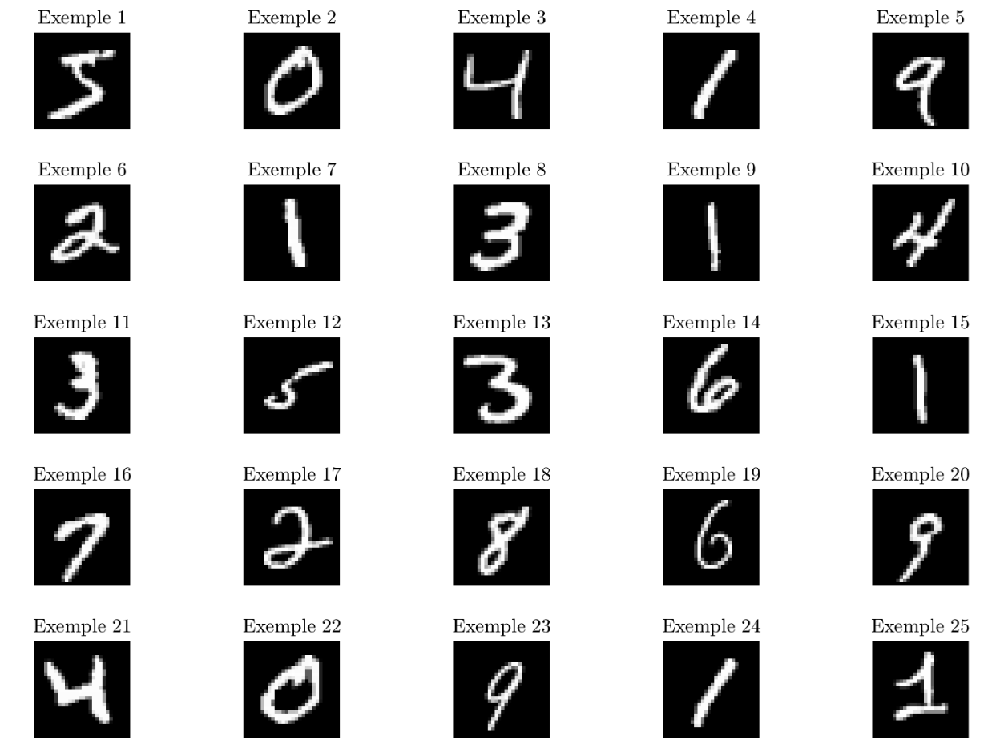
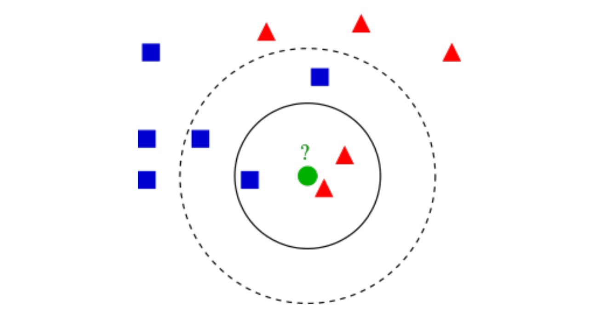

# Reconnaissance de chiffres manuscrits par k plus proches voisins

L’objectif de ce TP est de reconnaı̂tre des chiffres manuscrits d’une base de test à partir d’une base d’apprentissage 
et de la méthode des ``k`` plus proches voisins. La base de données du MNIST sur les chiffres manuscrits comprend un ensemble 
e 60 000 exemples d’apprentissage (*database\_train\_images*) et un ensemble de 10 000 exemples de test (*database\_test\_images*). 
Les chiffres, dont quelques exemples sont représentés sur la figure 1, ont été normalisés et centrés dans une image de taille fixe 28 ``\times`` 28 pixels.
``\\``

``\hspace*{4.5cm}`` Figure 1 – Exemples de chiffres manuscrits 

``\\`` Chaque image est considérée comme un vecteur 1D de ``28\times28 = 784`` coordonnées. On fournit les labels des
ensembles d’apprentissage (*database\_train\_labels*) et de test (*database\_test\_labels*).

## Exercice 1 : méthode des k plus proches voisins

En intelligence artificielle, la méthode des ``k`` plus proches voisins (``k``-ppv) est une méthode d'apprentissage supervisé. Dans ce cadre, on dispose d'une base de données d'apprentissage constituée de couples *donnée-label* . Pour estimer la sortie associée à une nouvelle entrée ``x``, la méthode des ``k`` plus proches voisins consiste à prendre en compte (de façon identique) les ``k`` échantillons d'apprentissage dont l'entrée est la plus proche de

la nouvelle entrée x, selon une distance à définir. L’algorithme 1 associé et un exemple (figure 2) sont donnés
par la suite.
``\\ \rule{14cm}{2.0pt} \\``
**Algorithm 1** Algorithme des ``k``-ppv ``\\``
Input : ``Data_{A}`` et ``Label_{A}`` ensemble de données et labels d'apprentissage, ``Data_{T}`` ensemble de test.
1. Soit ``x \in Data_{T}`` le point dont on cherche les ``k``-ppv au sens d'une distance ``d`` Calculer les distances ``d\left(x, x_{i}\right),\forall x_{i} \in D a t a_{A}``
2. Trouver les ``k`` points ``x_{k} \in D a t a_{A}`` plus proches voisins de ``x`` au sens de la distance ``d``
3. Déterminer la classe ``C`` la plus représentée parmi les ``k`` plus proches voisins de ``x``.
4. Assigner la classe ``C`` à la donnée ``x``.

FIGURE 2- Exemple de classification ``k``-ppv. L'échantillon de test (cercle vert) doit être classé soit dans la première classe des carrés bleus, soit dans la deuxième classe des triangles rouges. Si ``\mathrm{k}=3`` (cercle plein), il est assigné à la deuxième classe parce qu'il y a 2 triangles et seulement 1 carré à l'intérieur du cercle intérieur. Si ``\mathrm{k}=5`` (cercle en pointillés), il est assigné à la première classe (3 carrés contre 2 triangles à l'intérieur du cercle extérieur

#### Question :

En utilisant la distance euclidienne, complétez la fonction *kppv.m* permettant d’effectuer la classification par ``k``-ppv sur un ensemble de test à partir d’un ensemble d’apprentissage et de leurs labels et en spécifiant le nombre ``k`` voisins que l’on cherche.

## Exercice 2 : évaluation de la reconnaissance

En disposant des labels exacts des données de l’ensemble de test, l’évaluation de la bonne reconnaissance est
réalisée par une matrice de confusion et par un taux d’erreur :
- La matrice de confusion est une matrice ``10 \times 10`` dont l’élément générique d’indice ``(i, j)`` est le nombre de vecteurs de classe correspondant à l’indice ``i`` qui ont été affectés à la classe correspondant à l’indice ``j`` par le processus de décision. Si la matrice de confusion est diagonale alors la reconnaissance est parfaite.
- le taux d’erreur correspond à un pourcentage défini par le nombre d’éléments hors diagonaux de la matrice de confusion divisé par le nombre total d’éléments testés

#### Questions :
1. En utilisant les labels de l’ensemble de test *database\_test\_labels*, complétez kppv.m afin de rajouter le calcul de la matrice de confusion et le taux d’erreur.
2. Testez l’algorithme pour ``k = 1`` et ``k = 10`` et calculez les taux d’erreur respectifs.